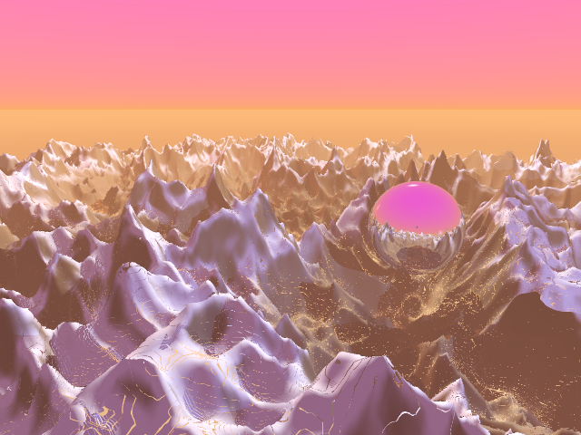
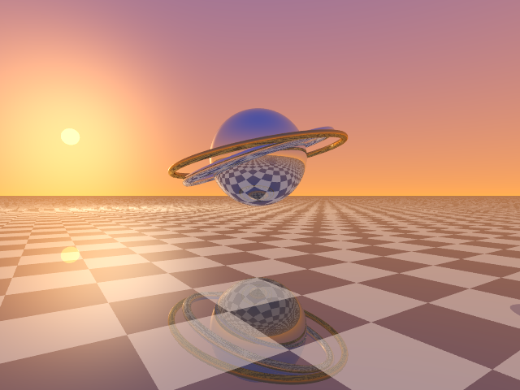
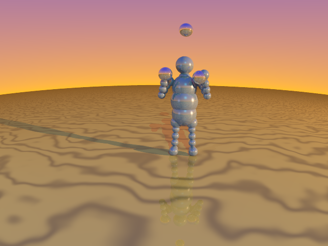
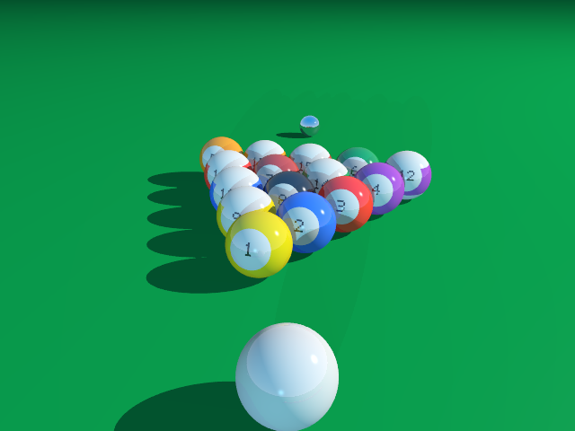
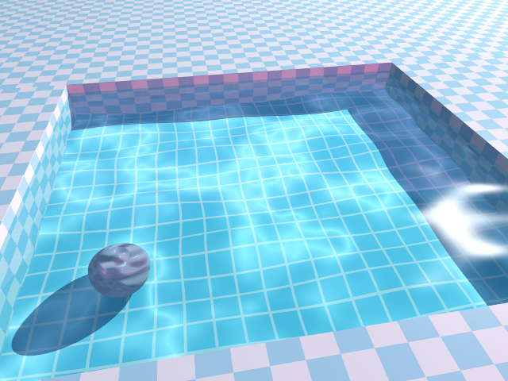
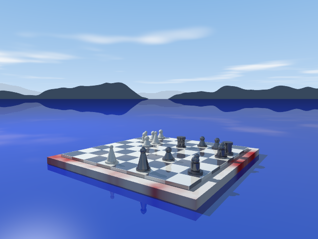

# RayTrace ’95

Ein Zufallsbild-Generator im Stil klassischer Raytracing-Bilder der 90er Jahre
(POV-Ray-Ära): verchromte Kugeln auf Schachbrettböden, Glasobjekte, harte
Schatten, kitschige Himmel.

Alles steckt in **einer einzigen HTML-Datei** ohne jede Abhängigkeit — kein
Build, kein Server, keine Bibliothek. `index.html` im Browser öffnen, fertig.
Der Raytracer, der Szenengenerator und sämtliche Encoder (PNG, GIF, ZIP, WebM)
sind in purem JavaScript von Hand geschrieben.

| | |
|---|---|
|  |  |
|  |  |
|  |  |

## Loslegen

```bash
git clone https://github.com/laserrapt0r/RayTrace-95.git
cd RayTrace-95
xdg-open index.html      # oder die Datei einfach doppelklicken
```

Dann **Neues Bild** klicken (oder Leertaste drücken). Für den schnellen
Einstieg: das Dropdown **Galerie** enthält eine kuratierte Auswahl berühmter
Motive.

## Bedienung

- **Neues Bild** (oder Leertaste): würfelt eine komplett neue Szene.
- **Variation**: würfelt gezielt nur einen Aspekt neu — Farben, Kamera,
  Himmel oder Layout — und behält den Rest exakt bei.
- **Seed**: Jedes Bild ist durch seinen Seed (`a.b.c.d`, vier Teilströme für
  Layout/Palette/Himmel/Kamera) exakt reproduzierbar. Beliebiger Text
  funktioniert ebenfalls als Master-Seed. Der Seed steht auch in der URL —
  Link kopieren genügt zum Teilen.
- **Szene/Palette**: erzwingt einen bestimmten Archetyp bzw. ein Farbschema.
- **Effekte-Panel**: Himmel, Nebel, Berge, Planeten, Gasnebel, Lens Flare,
  God-Rays, Prisma-Dispersion, Bloom und Fischauge sind einzeln per
  Auto/An/Aus wählbar; dazu Anaglyph 3D (Rot/Cyan) und ein Retro-Rahmen mit
  eingebrannter Bildunterschrift. Alle Einstellungen wandern in den
  Teilen-Link und in die Favoriten.
- **Qualität**: Schnell (1 Strahl/Pixel) · Adaptiv (Kantenglättung nur an
  Kanten) · Maximal (4× überall) · Ultra (zusätzlich weiche Schatten).
- **Bild-Leiste**: Farbintensität (Aus bis Extrem), Helligkeit,
  Spiegelungsstärke und Kontaktschatten (Ambient Occlusion). Das Farb-Grading
  wird **direkt beim Rendern** auf die Float-Farbwerte angewandt (vor der
  8-Bit-Wandlung, siehe `tone3`) — der knallige CRT-Look entsteht also im
  Renderer selbst, nicht als nachträglicher Filter, und ohne Banding durch
  Quantisierung. Der PNG-Export ist dadurch immer exakt das angezeigte Bild.
- **256 Farben**: Median-Cut-Quantisierung + Floyd-Steinberg-Dithering für
  den authentischen GIF-Look von damals.
- **Batch-ZIP**: rendert 8 Zufallsbilder und lädt sie gesammelt als ZIP.
- **Animation**: Kamerapfade Orbit, Spirale, Wellen (animiertes Wasser),
  Sonnenumlauf (wandernde Schatten) sowie Objekt-Animationen Jonglieren,
  Pendelschwung und Boing-Hüpfer — als endlos loopendes GIF oder als
  WebM-Video (WebCodecs, sofern der Browser es unterstützt). Alle Pfade
  loopen nahtlos.
- **Verlauf/Favoriten**: Thumbnails der letzten Bilder (localStorage), Klick
  lädt das Bild zurück. Favoriten lassen sich als JSON exportieren und in
  einem anderen Browser wieder importieren.

## Szenen-Archetypen

33 Archetypen sorgen dafür, dass kaum zwei Bilder einander ähneln:

- **Klassiker**: Kugeln auf Schachbrett, Formen-Mix, Säulenhalle,
  Kugelpyramide, schwebende Objekte, Zentralkugel, Wasser, Innenraum,
  Sphereflake, Helix, Türme, Glasbox, Ringe/Tori, Chaos.
- **Große Würfe**: Berglandschaft (echtes Raymarching-Heightfield mit Schnee,
  See und schwebender Chromkugel — der Bryce-Look), Blobs/Metaballs,
  Schwimmbad (transparentes Wasser über gekacheltem Becken mit
  Kaustik-Lichtnetz), Schachbrett mit Figuren, Spiegelsaal mit
  Endlos-Reflexionen, Menger-Schwamm, Säulenwald, fremde Welt (Planeten,
  Monolith, UFO).
- **Berühmte Motive**: der **Jongleur** (Hommage an Eric Grahams
  Amiga-Klassiker von 1986, inklusive Jonglier-Animation), der **Boing-Ball**,
  nummerierte **Billardkugeln** (die Ziffern werden per 5×7-Pixelschrift auf
  die Kugeloberfläche gerechnet), das **Newton-Pendel** (mit Schwung-Animation),
  **Stillleben** mit CSG-Weinglas und Trauben, **Studio**-Produktfotos,
  **Logo-Schriftzüge** aus extrudierten Buchstaben, **Würfel & Co** (CSG:
  Spielwürfel mit echten Augen-Mulden, angebissene Würfel, Schalen, Rohre).
- **Kulissen**: griechischer Tempel, Innenraum mit Fenster-Lichtschacht,
  Wendeltreppe.

Kombiniert werden sie mit 7 Farbschemata (inklusive reiner
POV-Ray-Primärfarben), 6 Himmelstypen (Wolken, Sterne, Gasnebel,
Silhouetten-Berge, Planeten mit Ringen), Nebel, God-Rays, Lens Flare und
Fake-Kaustiken unter Glasobjekten.

## Technik

- Rekursiver Raytracer in purem JavaScript: Kugel, Ebene, Box (rotiert),
  Zylinder, Kegel, **Torus** (Quartic-Löser nach Graphics Gems),
  **CSG** (Differenz/Schnitt konvexer Körper über Intervall-Arithmetik),
  **Heightfield-Terrain** (Grid-basiertes Raymarching) und
  **Blobs/Metaballs** (Feld-Marching mit analytischen Normalen).
- Spiegelung, Brechung mit Fresnel (Schlick), farbige Glas-Schatten,
  prozedurale Texturen (Schachbrett, Marmor, Holz, Bozo, Streifen, Grid),
  Bump-Mapping, Distanz-Fade gegen Moiré.
- Effekte: volumetrische God-Rays, Prisma-Dispersion (Brechung pro
  Farbkanal), Bloom/Glow, Anaglyph 3D, Fischaugen-Projektion,
  Ambient Occlusion und Subsurface-Schimmer bei Marmor.
- **BVH** (Bounding Volume Hierarchy) für Szenen mit hunderten Objekten.
- **Web-Worker-Pool** (bis 8 Threads) mit automatischem
  Hauptthread-Fallback; `?noworker` in der URL erzwingt den Fallback.
- Eigene Encoder, alles ohne Bibliotheken: PNG (via Canvas), animiertes
  GIF89a (LZW), ZIP (Store) und WebM (minimaler EBML-Muxer für
  VP8-Chunks aus WebCodecs).

## Headless-Rendern / Tests

Der Renderkern lässt sich mit Node ohne Browser ausführen — praktisch als
Batch-Renderer und als Regressionstest:

```bash
# Einzelne Bilder rendern (Ausgabeordner, dann Seeds)
node test/render.js out 42 1234:terrain "7:forest:rays=1,sky=sunset"

# Robustheits-Sweep: 400 Seeds über alle Archetypen, prüft auf Fehler
SWEEP=400 node test/render.js
```

Umgebungsvariablen: `W`/`H` (Auflösung), `MODE` (0–3, wie die Qualitätsstufen),
`DITHER=1` (256 Farben), `BLOOM=1`, `FRAME=1` (Retro-Rahmen),
`NOGRADE=1` (ohne Farb-Grading), `GIF=1` (zusätzlich ein kleines Orbit-GIF).

## Browser-Unterstützung

Läuft in jedem modernen Browser. Der WebM-Export setzt WebCodecs voraus
(Chrome/Edge); ohne WebCodecs wird die Option automatisch deaktiviert, der
GIF-Export funktioniert überall.

## Lizenz

[MIT](LICENSE) — © 2026 Tommy Wurzbacher
